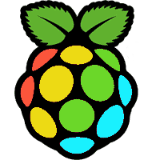

# ZX Raspberry

**ZX Raspberry** is a bare metal [Sinclair ZX Spectrum](https://en.wikipedia.org/wiki/ZX_Spectrum) emulator for the [Raspberry Pi](https://www.raspberrypi.org), that is, an emulator that runs natively on the Raspberry Pi hardware without the need for an operating system.

The bare metal approach to emulation has a number of benefits as well as drawbacks.  The benefits include the ability to start the emulator in about 2.5 seconds as well as having complete control over the hardware without having to share it with other operating system or user processes.

The biggest drawback is that the emulator needs to implement many of the features that are normally provided by the operating system and developing software for the bare metal is significantly harder and more time-consuming.

Although primarily targeted at the Raspberry Pi family of computers, ZX Raspberry is also intended to compile and run natively on macOS using the [Qt library](https://www.qt.io).
