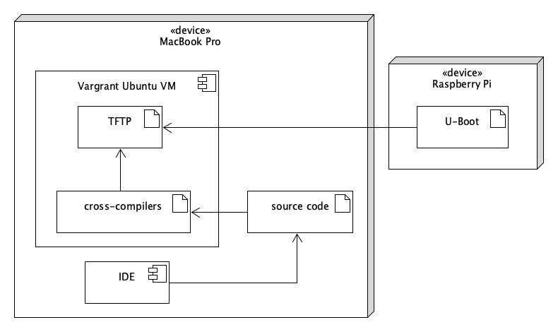

## Welcome to ZX Raspberry

[](https://masterminds.github.io/stability/experimental.html)

**ZX Raspberry** is a bare metal [Sinclair ZX Spectrum](https://en.wikipedia.org/wiki/ZX_Spectrum) emulator for the [Raspberry Pi](https://www.raspberrypi.org), that is, an emulator that runs natively on the Raspberry Pi hardware without the need for an operating system.

The bare metal approach to emulation has a number of benefits as well as drawbacks.  The benefits include the ability to start the emulator in about 2.5 seconds as well as having complete control over the hardware without having to share it with other operating system or user processes.

The biggest drawback is that the emulator needs to implement many of the features that are normally provided by the operating system and developing software for the bare metal is significantly harder and more time-consuming.

Although primarily targeted at the Raspberry Pi family of computers, ZX Raspberry is also intended to compile and run natively on macOS using the [Qt library](https://www.qt.io).

## Setting-up a development environment

### Overview

The first step in the development of our emulator is the creation of a consistent development environment that can be built easily and repeatably from scratch in just a few minutes and on as many platforms as possible.  To achieve this, we will be using [HashiCorp's Vagrant](https://www.vagrantup.com) and [RedHat's Ansible](https://www.ansible.com).  The former creates the virtual machine on which our development environment will be hosted and the latter configures the actual development environment inside the virtual machine. In our particular setup, Vagrant will be using [VirtualBox](https://www.virtualbox.org) as the virtualization engine.



We will also be using [U-Boot](https://github.com/u-boot/u-boot#readme) together with a TFTP server, the latter running inside the Vagrant virtual machine, to deploy out emulator's cross-compiled code to the Raspberry Pi over the network thus avoiding the need for swapping SD cards.

### Building the Vagrant Box

> NOTE: at the time of writing, our default Vagrant and Ansible configurations target the Raspberry Pi 4 as the destination device for cross compilation.  Future versions will build an environment suitable for all Raspberry Pi models simultaneously.

#### Getting started

On macOS, the tools required to build the cross-compilation development environment for Raspberry Pi can be easily installed using the brew package manager. e.g.

```sh
echo
echo "Installing VirtualBox"
brew cask install virtualbox

echo
echo "Installing Vagrant"
brew cask install vagrant

# (optional) delete the installation of curl bundled with Vagrant if it causes problems when initialising Vagrant boxes
sudo rm -f /opt/vagrant/embedded/bin/curl

echo "Installing Vagrant's VirtualBox guest plug-in (https://github.com/dotless-de/vagrant-vbguest)"
vagrant plugin install vagrant-vbguest

echo "Installing the Ansible infrastructure tool"
brew install ansible
```

#### Running Vagrant and Ansible

The vagrant configuration file required to create the development environment is located in the `vagrant` folder of the ZX Raspberry project. 

To create a Vagrant box (i.e. linux virtual machine) with a fully configured development environment, open a command shell in tge `vagrant` folder and run this command:

```sh
vagrant up
```

If the operation is successful you will see output similar to this after a few minutes:

```text
No SSH key found. You will need to remedy this before pushing to the repository.
Bringing machine 'raspberry-pi-cross-compiler' up with 'virtualbox' provider...
==> raspberry-pi-cross-compiler: Importing base box 'ubuntu/xenial64'...
==> raspberry-pi-cross-compiler: Matching MAC address for NAT networking...
==> raspberry-pi-cross-compiler: Checking if box 'ubuntu/xenial64' version '20191204.0.0' is up to date...
==> raspberry-pi-cross-compiler: Setting the name of the VM: circle_raspberry-pi-cross-compiler_1575832766177_12344
==> raspberry-pi-cross-compiler: Clearing any previously set network interfaces...
==> raspberry-pi-cross-compiler: Preparing network interfaces based on configuration...
    raspberry-pi-cross-compiler: Adapter 1: nat
==> raspberry-pi-cross-compiler: Forwarding ports...
    raspberry-pi-cross-compiler: 22 (guest) => 2222 (host) (adapter 1)
==> raspberry-pi-cross-compiler: Running 'pre-boot' VM customizations...
==> raspberry-pi-cross-compiler: Booting VM...
==> raspberry-pi-cross-compiler: Waiting for machine to boot. This may take a few minutes...
    raspberry-pi-cross-compiler: SSH address: 127.0.0.1:2222
    raspberry-pi-cross-compiler: SSH username: vagrant
    raspberry-pi-cross-compiler: SSH auth method: private key
    raspberry-pi-cross-compiler: 
    raspberry-pi-cross-compiler: Vagrant insecure key detected. Vagrant will automatically replace
    raspberry-pi-cross-compiler: this with a newly generated keypair for better security.
    raspberry-pi-cross-compiler: 
    raspberry-pi-cross-compiler: Inserting generated public key within guest...
    raspberry-pi-cross-compiler: Removing insecure key from the guest if it's present...
    raspberry-pi-cross-compiler: Key inserted! Disconnecting and reconnecting using new SSH key...
==> raspberry-pi-cross-compiler: Machine booted and ready!
==> raspberry-pi-cross-compiler: Checking for guest additions in VM...
    raspberry-pi-cross-compiler: The guest additions on this VM do not match the installed version of
    raspberry-pi-cross-compiler: VirtualBox! In most cases this is fine, but in rare cases it can
    raspberry-pi-cross-compiler: prevent things such as shared folders from working properly. If you see
    raspberry-pi-cross-compiler: shared folder errors, please make sure the guest additions within the
    raspberry-pi-cross-compiler: virtual machine match the version of VirtualBox you have installed on
    raspberry-pi-cross-compiler: your host and reload your VM.
    raspberry-pi-cross-compiler: 
    raspberry-pi-cross-compiler: Guest Additions Version: 5.1.38
    raspberry-pi-cross-compiler: VirtualBox Version: 6.0
==> raspberry-pi-cross-compiler: Setting hostname...
==> raspberry-pi-cross-compiler: Mounting shared folders...
    raspberry-pi-cross-compiler: /vagrant => /Users/jose.hernandez/Developer/doraemoncito/emulators/vagrant/circle
==> raspberry-pi-cross-compiler: Running provisioner: shell...
    raspberry-pi-cross-compiler: Running: inline script
==> raspberry-pi-cross-compiler: Running provisioner: shell...
    raspberry-pi-cross-compiler: Running: inline script
    raspberry-pi-cross-compiler: SSH keys already provisioned.
==> raspberry-pi-cross-compiler: Running provisioner: ansible_local...
    raspberry-pi-cross-compiler: Installing Ansible...
Vagrant has automatically selected the compatibility mode '2.0'
according to the Ansible version installed (2.9.2).

Alternatively, the compatibility mode can be specified in your Vagrantfile:
https://www.vagrantup.com/docs/provisioning/ansible_common.html#compatibility_mode

    raspberry-pi-cross-compiler: Running ansible-playbook...
cd /vagrant && PYTHONUNBUFFERED=1 ANSIBLE_FORCE_COLOR=true ansible-playbook --limit="all" --inventory-file=hosts -v provision.yml
Using /vagrant/ansible.cfg as config file

PLAY [all] *********************************************************************

TASK [Gathering Facts] *********************************************************
ok: [192.168.33.10]

...

PLAY RECAP *********************************************************************
192.168.33.10              : ok=11   changed=10   unreachable=0    failed=0    skipped=0    rescued=0    ignored=0   
```

To run the provisioning scripts again after creating the Vagrant box, run this command:

```sh
vagrant up --provision
```

Log into the box with:

```sh
vagrant ssh
```

#### Deleting the virtual machine

Use the following command to forcibly delete the virtual machine and release the disk space;

```sh
vagrant destroy --force
```

Upon successful completion, a message like this will appear on the terminal:

```text
No SSH key found. You will need to remedy this before pushing to the repository.
==> raspberry-pi-cross-compiler: Forcing shutdown of VM...
==> raspberry-pi-cross-compiler: Destroying VM and associated drives...
```

## Cross-compiler toolchains

| Raspberry Pi model | Bus width | CMake toolchain configuration file | Prefix         | Cross-compiler destribution file                |
| ------------------ | --------- | ---------------------------------- | -------------- | ----------------------------------------------- |
| 1                  | 32 bits   | toolchain-arm-eabi.cmake           | arm-eabi-      | gcc-arm-8.2-2019.01-x86_64-arm-eabi.tar.xz      |
| 0, 1, 2, 3, 4      | 32 bits   | toolchain-arm-none-eabi.cmake      | arm-none-eabi- | gcc-arm-9.2-2019.12-x86_64-arm-none-eabi.tar.xz |
| 4                  | 64 bits   | toolchain-arm-aarch64-elf.cmake    | aarch64-elf-   | gcc-arm-8.3-2019.03-x86_64-aarch64-elf.tar.xz   |

Please note that `arm-eabi` is deprecated and `arm-none-eabi` should instead be used for all 32 bit targets, including the original Raspberry Pi.

## Building U-Boot

> **NOTE:** many of the step descibed in this section will be performed automatically during the development environment installation using Ansible.

### Compiling Das U-boot

[](https://www.beyondlogic.org/compiling-u-boot-with-device-tree-support-for-the-raspberry-pi/)

Install the pre-requisites:

```sh
sudo apt-get install -y bison flex
```

Check-out of the source code:

```sh
git clone git://git.denx.de/u-boot.git
cd u-boot
```

These are the 32 kernel image names by Raspebrry Pi model:

| RASPPI | Target         | Models                   | Optimized for |
| ------ | -------------- | ------------------------ | ------------- |
| 1      | kernel.img     | A, B, A+, B+, Zero, (CM) | ARM1176JZF-S  |
| 2      | kernel7.img    | 2, 3, (CM3)              | Cortex-A7     |
| 3      | kernel8-32.img | 3, (CM3)                 | Cortex-A53    |
| 4      | kernel7l.img   | 4B, 400, CM4             | Cortex-A72    |

Next, set the default configuration. This will vary depending upon the Raspberry Pi variant you wish to target:

| Raspberry Pi Variant              | Processor | Kernel image   | Configuration File     | Cross-compiler prefix |
| --------------------------------- | --------- | -------------- | ---------------------- | --------------------- |
| Raspberry Pi Model A              | BCM2835   | kernel.img     | rpi_defconfig          | arm-none-eabi-        |
| Raspberry Pi Model A+             | BCM2835   | kernel.img     | rpi_defconfig          | arm-none-eabi-        |
| Raspberry Pi Model B+             | BCM2835   | kernel.img     | rpi_defconfig          | arm-none-eabi-        |
| Raspberry Pi Compute Module       | BCM2835   | kernel.img     | rpi_defconfig          | arm-none-eabi-        |
| Raspberry Pi Zero                 | BCM2835   | kernel.img     | rpi_defconfig          | arm-none-eabi-        |
| Raspberry Pi Zero W               | BCM2835   | kernel.img     | rpi_0_w_defconfig      | arm-none-eabi-        |
| Raspberry Pi 2 Model B            | BCM2836   | kernel7.img    | rpi_2_defconfig        | arm-none-eabi-        |
| Raspberry Pi 3 Model B            | BCM2837   | kernel8-32.img | rpi_3_defconfig        | arm-none-eabi-        |
| Raspberry Pi 3 Model B+           | BCM2837B0 | kernel8-32.img | rpi_3_b_plus_defconfig | aarch64-elf-          |
| Raspberry Pi 4 Model B+ (32 bits) | BCM2711B0 | kernel7l.img   | rpi_4_32b_defconfig    | arm-none-eabi-        |
| Raspberry Pi 4 Model B+ (64 bits) | BCM2711B0 | kernel8.img    | rpi_4_defconfig        | aarch64-elf-          |

For more detailed hardware information please see the [Raspberry Pi specifications on Wikipedia](https://en.wikipedia.org/wiki/Raspberry_Pi#Specifications).

For example, if we wish to target the Raspberry Pi Model B+, we run the following command to configure the U-Boot build:

```sh
make CROSS_COMPILE=arm-none-eabi- rpi_defconfig
```

and finally compile U-Boot with this command:

```sh
make CROSS_COMPILE=arm-none-eabi- u-boot.bin
```

Then copy the resulting *u-boot.bin* to the SD card and rename it *kernel.img* (for Raspberry Pi 1)

> **NOTE:** Run the `ntpdate` command to synchonise the Virtual Machine's clock, e.g.  `sudo ntpdate time.nist.gov` if you get a warning like this when building the code:
> 
>```text
>make[1]: warning:  Clock skew detected.  Your build may be incomplete.
>```

The following scripts compiles a set of five U-Boot kernel images that can all be placed simultaneously on the same SD card to boot on any Raspberry Pi model.

```sh
echo "Synchronizing the Virtual Machine's clock"
sudo ntpdate time.nist.gov

echo "Compiling U-Boot for Raspberry Pi 1"
make CROSS_COMPILE=arm-none-eabi- distclean rpi_defconfig u-boot.bin
mv u-boot.bin ../kernel.img

echo "Compiling U-Boot for Raspberry Pi 2"
make CROSS_COMPILE=arm-none-eabi- distclean rpi_2_defconfig u-boot.bin
mv u-boot.bin ../kernel7.img

echo "Compiling U-Boot for Raspberry Raspberry Pi 3 Model B+"
make CROSS_COMPILE=aarch64-elf- distclean rpi_3_b_plus_defconfig u-boot.bin
mv u-boot.bin ../kernel8-32.img

echo "Compiling U-Boot for Raspberry Pi 4B (32 bits)"
make CROSS_COMPILE=arm-none-eabi- distclean rpi_4_32b_defconfig u-boot.bin
mv u-boot.bin ../kernel7l.img

echo "Compiling U-Boot for Raspberry Pi 4B (64 bits)"
make CROSS_COMPILE=aarch64-elf- distclean rpi_4_defconfig u-boot.bin
mv u-boot.bin ../kernel8.img
```
